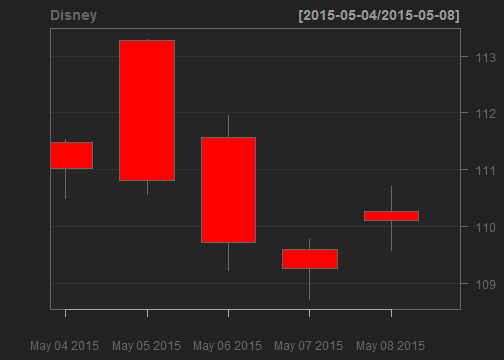

## Project Pitch

You may have read that the movie Avengers: Age of Ultron have crossed the $1 billion mark in box-office worldwide after 15-May-2015.

As this movie is owned by Disney, wouldn't you like to know how Disney stock prices react to this news? 

Has Disney stock price been trending up even before this movie's release?

As a reference, Iron Man 3 was released worldwide on 25-Apr-2013 and grossed $1.2 billion. Would you like to check how Disney's stock price performed from 25-Apr-2013 to 31-Dec-2013 and in 2014 when they release their full year numbers?

You can answer these questions and more using my Simple Stock App.

--- .class #id 

## Simple Stock App uploaded in shinyapps.io

You can access the app in below link.

The documentation on how to use the app can be found in the first tab.

https://ichew.shinyapps.io/_dataproducts/

Have fun and May The Force Be with You! 
(Will Disney's next blockbuster Star Wars boost its price?)

--- .class #id 

## Running embedded R Code (1/2)

Below is an R expression that will be run in the next slide.

It extracts 5 days Disney stock prices from yahoo and plot a simple candlestick chart.

This is to fulfil the requirements "Did it contain an R expression that got evaluated and displayed?".


```r
options(warn=-1)
library(quantmod)
dis_env <- new.env()
getSymbols("DIS", env = dis_env, src = "yahoo", 
           from = as.Date("2015-05-04"), to = as.Date("2015-05-08"))
vDIS <- dis_env$DIS
chartSeries(vDIS, name = "Disney", type = "candlesticks", 
            theme = chartTheme("black"), up.col = "lightblue", dn.col = "red",TA=NULL                  
            )
```

--- .class #id 

## Running embedded R Code (2/2)

[1] "DIS"
 
